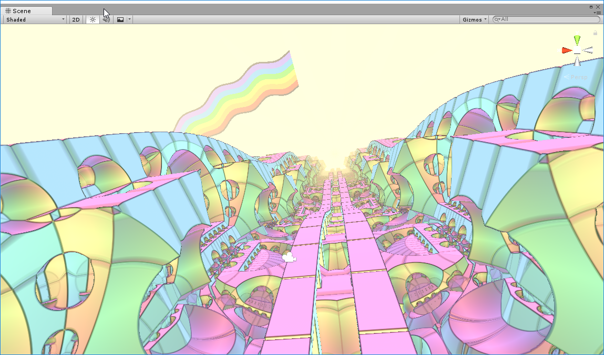
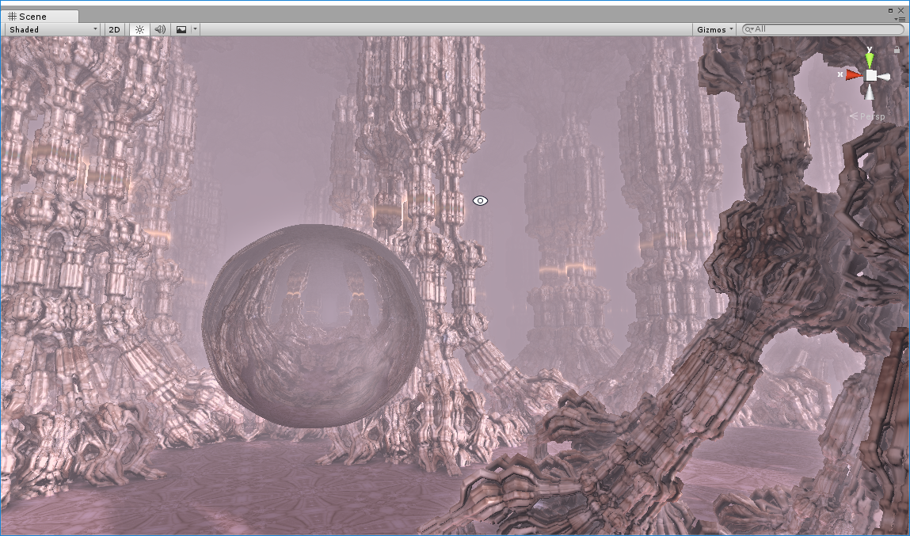
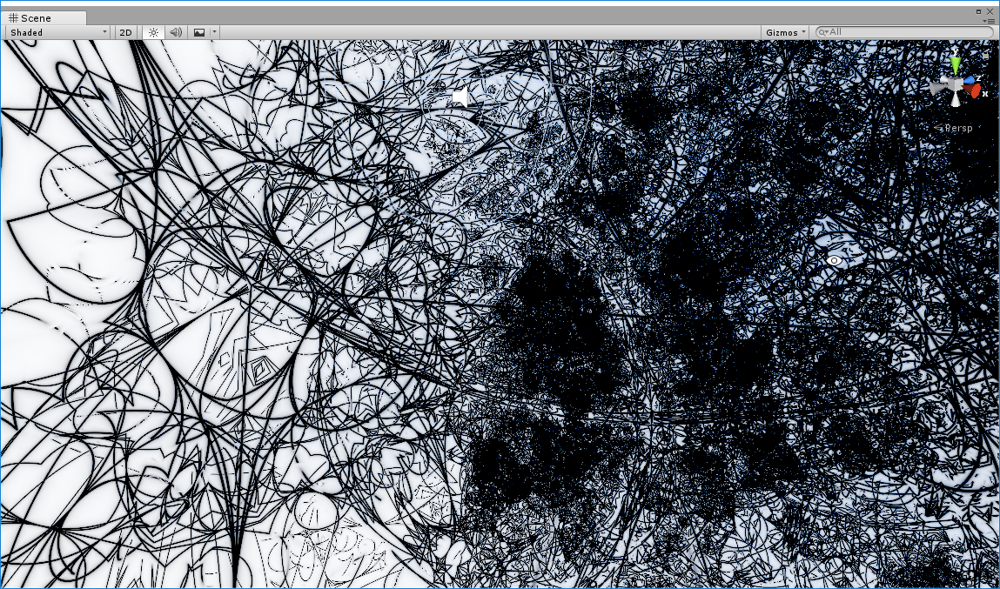
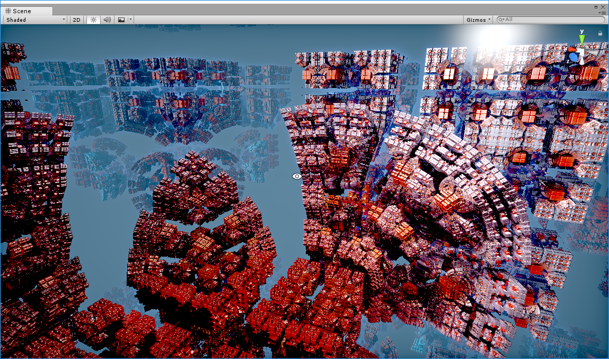
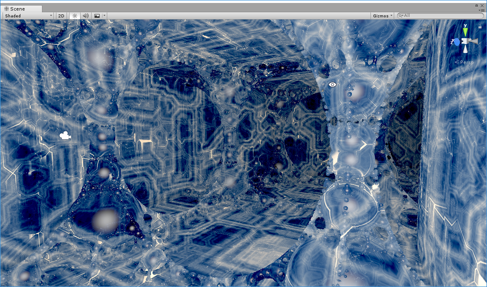
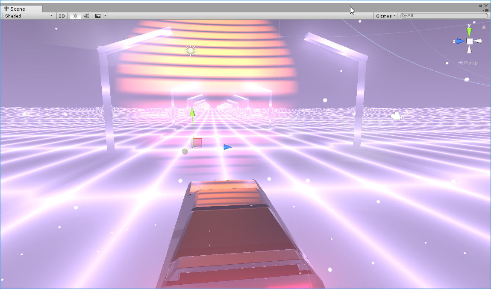

# ShadertoyShadersForUnity

A selection of raymarched Shadertoy shaders converted for use in unity and VRChat. Translated by Clawbird (on discord at Pathos#0925) with Angle and some C#.
### Find these on Shadertoy.com

### FractalLand
#### by Kali
https://www.shadertoy.com/view/XsBXWt

### Generators
#### by Kali
https://www.shadertoy.com/view/Xtf3Rn

### kalizulmodul
#### by bergi
https://www.shadertoy.com/view/Mtl3R2

### Remnant X
#### by Dave_Hoskins
https://www.shadertoy.com/view/4sjSW1

### Server Room
#### by zackpudil
https://www.shadertoy.com/view/MdySzc

### [SH16B] Speed Drive 80
#### by knarkowicz
https://www.shadertoy.com/view/4ldGz4

