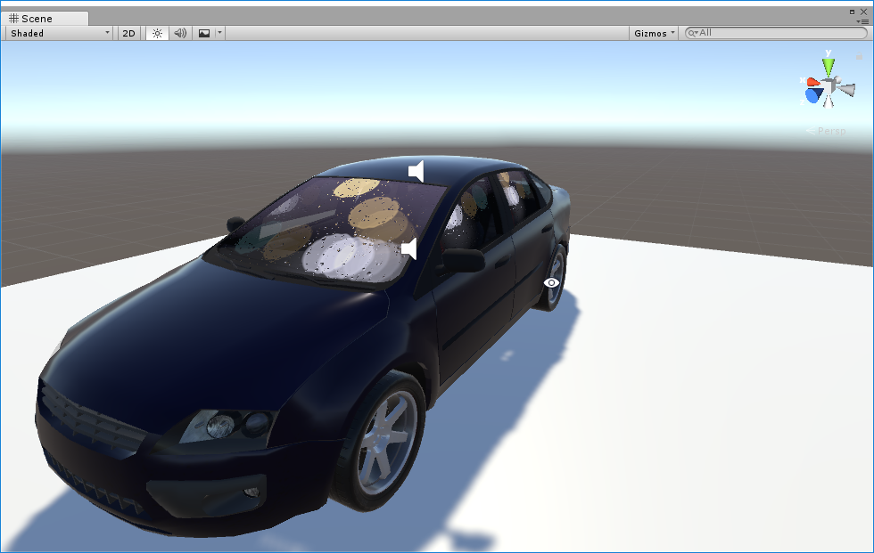
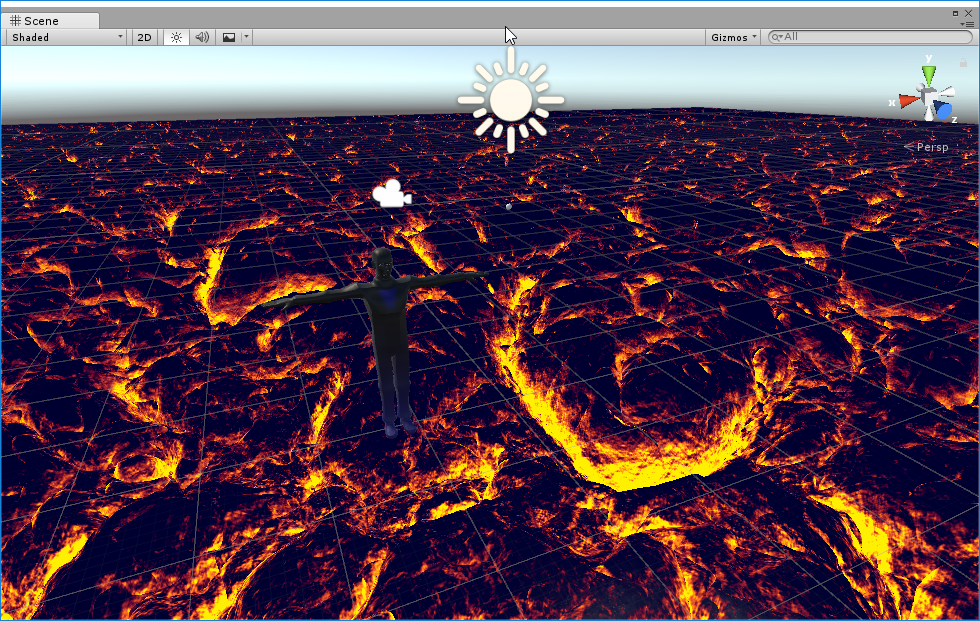

# ShadertoyShadersForUnity

A selection of raymarched Shadertoy shaders converted for use in unity and VRChat. Translated by Clawbird (on discord at Pathos#0925) with Angle and some C#. To make these double-sided add "Cull Off" under "LOD 100". To make these draw over everything add or uncomment "ZTest Always", or comment to disable. Adjust DistanceThreshold to set how close you need to be able to see it. Some of these are very expensive and will lower many peoples FPS so I suggest setting this rather close. Also, please use these responsibly and provide some sort of warning.

### Find these on Shadertoy.com

### FractalLand
#### by Kali
https://www.shadertoy.com/view/XsBXWt

### Generators
#### by Kali
https://www.shadertoy.com/view/Xtf3Rn

### kalizulmodul
#### by bergi
https://www.shadertoy.com/view/Mtl3R2

### Remnant X
#### by Dave_Hoskins
https://www.shadertoy.com/view/4sjSW1

### Server Room
#### by zackpudil
https://www.shadertoy.com/view/MdySzc

### [SH16B] Speed Drive 80
#### by knarkowicz
https://www.shadertoy.com/view/4ldGz4

### The Drive Home
#### by BigWIngs
https://www.shadertoy.com/view/MdfBRX

### Hot Rocks
#### by dr2
https://www.shadertoy.com/view/4lSXR3

